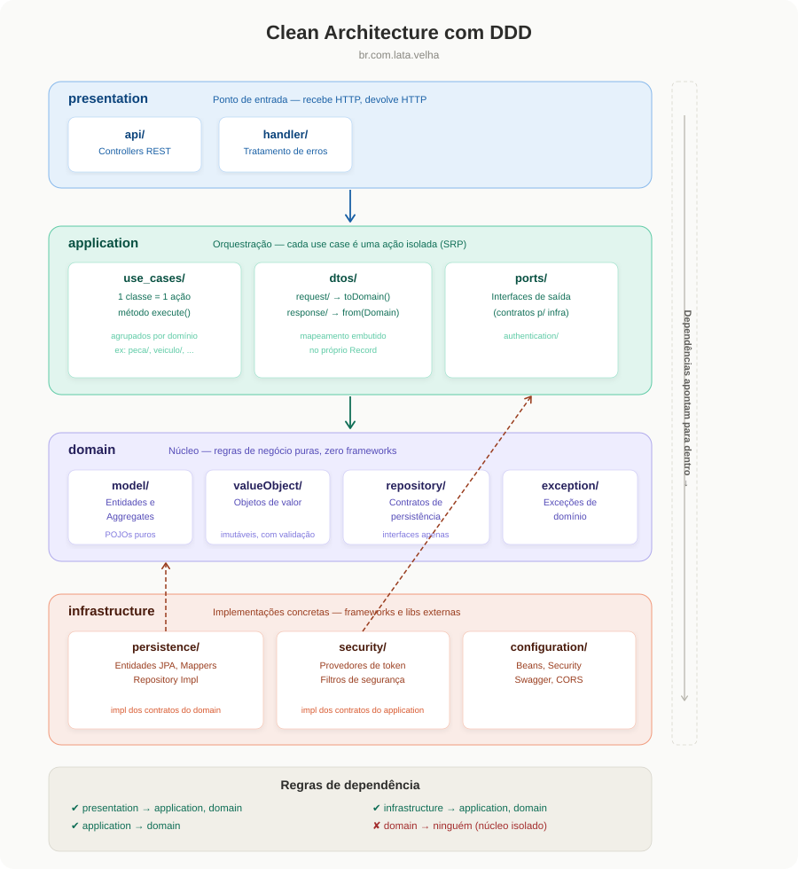

<h1 align="center">🚗 Lata Velha</h1>

<h3 align="center">Pós-Tech FIAP — Arquitetura de Software</h3>

<p align="center">
  Sistema de gestão automotiva com DDD e Clean Architecture
</p>

<p align="center">
  
  
  
  
  
  
</p>

---

## Arquitetura

O projeto segue **Domain-Driven Design (DDD)** com arquitetura em camadas, onde cada camada possui responsabilidades bem definidas e as dependências sempre apontam para o centro (domínio).

<p align="center">
  
</p>

```
br.com.lata.velha
├── presentation/        → Entrada HTTP (controllers, exception handlers)
├── application/         → Casos de uso, DTOs, assemblers e portas de saída
├── domain/              → Regras de negócio puras (zero frameworks)
└── infrastructure/      → JPA, JWT, configs do Spring
```

**Regra principal:** o `domain` não importa nenhuma outra camada. A `infrastructure` implementa as interfaces definidas pelo `domain` e `application`, conectadas via injeção de dependência do Spring.

---

## Pré-requisitos

- **Java 21**
- **Docker** instalado e rodando
- **Maven** (ou usar o wrapper `./mvnw`)

---

## Como rodar

**1. Subir o banco de dados e SonarQube**

```bash
docker compose -f docker/docker-compose.yml up -d
```

**2. Verificar se os containers estão rodando**

```bash
docker ps
```

**3. Rodar a aplicação**

```bash
mvn spring-boot:run
```

**4. Acessar o Swagger**

```
http://localhost:8080/swagger-ui.html
```

---

## Banco de dados

| Propriedade | Valor        |
| ----------- | ------------ |
| Host        | `localhost`  |
| Porta       | `5432`       |
| Database    | `lata_velha` |
| Usuário     | `admin`      |
| Senha       | `admin123`   |

---

## Autenticação

O sistema utiliza **JWT com chaves RSA** para autenticação. Após o login, o token deve ser informado no Swagger para acessar os endpoints protegidos.

**Usuários pré-cadastrados:**

| Usuário     | Senha    | Role     |
| ----------- | -------- | -------- |
| `admin`     | `123456` | ADMIN    |
| `atendente` | `123456` | USER     |
| `mecanico`  | `123456` | MECANICO |

**Como autenticar no Swagger:**

1. Faça `POST /auth/login` com username e senha
2. Copie o token retornado (sem aspas)
3. Clique em **Authorize** no Swagger
4. Cole o token e confirme

---

## Testes

**Rodar todos os testes:**

```bash
mvn clean test
```

**Visualizar cobertura (JaCoCo):**

```bash
mvn clean verify
open target/site/jacoco/index.html
```

O relatório mostra a cobertura por pacote, classe e linha. O projeto utiliza **JUnit 5** para testes unitários com foco nos domínios críticos (models e value objects).

```
src/test/java/br/com/lata/velha/domain/
├── model/         → Proprietario, Veiculo, Funcionario, Cargo, Role
└── valueObject/   → Documento, Placa, NumeroCelular, Endereco, Senha
```

---

## SonarQube

O projeto utiliza **SonarQube Community Edition** para análise estática de código. Ele identifica bugs, vulnerabilidades, code smells e mede a cobertura de testes.

**1. Subir o SonarQube (já incluso no docker-compose)**

```bash
docker compose -f docker/docker-compose.yml up -d
```

**2. Acessar o painel**

```
http://localhost:9000
```

Login padrão: `admin` / `admin` (será pedido para trocar na primeira vez)

**3. Gerar token de análise**

- Avatar (canto superior direito) → **My Account** → **Security**
- Em **Generate Tokens**: nome `lata-velha`, tipo **Global Analysis Token**
- Clique **Generate** e copie o token

**4. Rodar a análise**

```bash
mvn clean test sonar:sonar -Dsonar.token=SEU_TOKEN_AQUI
```

**5. Ver os resultados**

Acesse `http://localhost:9000` e clique no projeto **Lata-Velha**.

| Métrica         | Descrição                               |
| --------------- | --------------------------------------- |
| Security        | Vulnerabilidades de segurança           |
| Reliability     | Bugs que podem causar falhas            |
| Maintainability | Code smells que dificultam manutenção   |
| Coverage        | Percentual de código coberto por testes |
| Duplications    | Trechos de código duplicados            |

---

## Parar tudo

```bash
docker compose -f docker/docker-compose.yml down -v
```

O flag `-v` remove os volumes, limpando os dados do banco e do SonarQube.

---

## Tecnologias

| Tecnologia      | Uso                            |
| --------------- | ------------------------------ |
| Java 21         | Linguagem principal            |
| Spring Boot 3.2 | Framework web e DI             |
| Spring Security | Autenticação JWT com RSA       |
| Spring Data JPA | Persistência                   |
| PostgreSQL 16   | Banco de dados relacional      |
| Flyway          | Versionamento de migrations    |
| Swagger/OpenAPI | Documentação interativa da API |
| JUnit 5         | Testes unitários               |
| JaCoCo          | Cobertura de testes            |
| SonarQube       | Análise estática de código     |
| Docker Compose  | Orquestração de containers     |
| Lombok          | Redução de boilerplate         |
