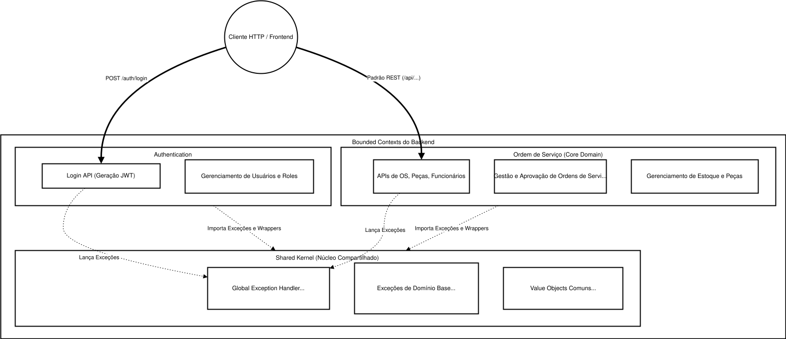

<h1 align="center">🚗 Lata Velha</h1>

<h3 align="center">Pós-Tech FIAP — Arquitetura de Software</h3>

<p align="center">
  Sistema de gestão automotiva com DDD
</p>

<p align="center">
  
  
  
  
  
  
</p>

---

## Arquitetura

O projeto segue **Domain-Driven Design (DDD)** com arquitetura em camadas, onde cada camada possui responsabilidades bem definidas e as dependências sempre apontam para o centro (domínio).

<p align="center">
  
</p>

```
br.com.lata.velha
├── api/                 → Entrada HTTP (controllers, exception handlers)
├── application/         → Casos de uso, DTOs e gateways (interfaces para serviços externos)
├── domain/              → Regras de negócio puras (zero frameworks)
└── infrastructure/      → JPA, JWT, configs do Spring
```

**Regra principal:** o `domain` não importa nenhuma outra camada. A `infrastructure` implementa as interfaces definidas pelo `domain` e `application`, conectadas via injeção de dependência do Spring.

### Estrutura de Contextos

O código é dividido em 3 contextos bem separados:

<p align="center">
  
</p>

**Authentication**
- Só cuida de login e gerar token JWT
- Basicamente: usuário entra com email/senha e recebe um token que é válido por 1 hora
- Fica em `authentication/`, totalmente isolado do restante do código

**Ordem de Serviço**
- Aqui roda o core business da oficina: proprietários, veículos, serviços, peças, ordens de serviço
- Uma OS passa por diferentes estados quando criada: recebida → diagnóstico → aguardando aprovação → aprovada → execução → finalizada → entregue
- Se o proprietário recusar todos os serviços identificados, a Ordem de Serviço é reprovada, liberando a retirada do veículo
- Fica tudo em `ordem_servico/`

**Shared**
- Código que qualquer contexto precisa: exceções, validadores, tipos básicos que se repetem

## Pré-requisitos

- **Java 21** — verificar no terminal com `java -version`
- **Docker** instalado e rodando — testar no terminal com `docker ps`
- **Git** pra clonar o projeto

---

## Como rodar

### Infraestrutura

O arquivo principal traz PostgreSQL + aplicação:
```bash
docker compose up --build -d
```

Se necessário acesso ao banco com PgAdmin e SonarQube, rode:
```bash
docker compose -f docker/docker-compose-dev.yml up -d
```
(PgAdmin fica em http://localhost:5050, email `admin@admin.com` / senha `admin123`)

Verificar se está tudo rodando:
```bash
docker ps
```

### Usando a API

Abra o Swagger em http://localhost:8080/swagger-ui.html

Pra acessar os endpoints protegidos, é necessário fazer login primeiro:
1. Procure a seção **Authentication**
2. Clique em `POST /auth/login`
3. Passe `admin@latavelha.com` como login e `Admin@123` como senha
4. Copie o token que é retornado
5. Clique no botão **Authorize** (canto direito em cima)
6. Cole o token (sem prefixo `Bearer`) e confirme
7. Pronto, todos os endpoints autenticados funcionam

Para parar tudo:
```bash
docker compose down -v
```
(o `-v` limpa os volumes, apagando dados do banco e SonarQube)

E pgAdmin e Sonar:
```bash
docker compose -f docker/docker-compose-dev.yml down -v
```

---

## Configurações por Contexto

**Desenvolvimento local:**
- Banco: PostgreSQL em localhost:5432
- App: http://localhost:8080
- Sem profile especial — pega a `application.yaml` default

**Via Docker:**
- App roda num container Docker
- Seta `ENVIRONMENT=docker` automaticamente
- Banco fica em `postgres:5432` (nome do hostname no Docker)
- App na porta 8080, SonarQube na 9000

**Durante testes:**
- BD em memória (H2)
- Profile `test` ativa automaticamente
- Migrations desligadas (schema é criado fresh cada vez)

**Credenciais padrão (de desenvolvimento):**
- Host BD: `localhost` (ou `postgres` se Docker)
- Porta: 5432
- Database: `lata_velha`
- Usuário: `admin`
- Senha: `admin123`

### Soft-Delete

Todas as entidades importantes têm uma coluna `ATIVO` (true/false). Quando você deleta algo, na verdade é só marcado como `ATIVO = false`. Quando lista, só aparecem os ativos.

Use `PATCH /recurso/{id}/desativar` pra inativar e `PATCH /recurso/{id}/reativar` pra ativar novamente.

---

## Autenticação

O sistema usa JWT com RSA (chaves de 2048 bits). Basicamente: você faz login, recebe um token, envia o token em toda requisição protegida.

**Detalhes do token:**
- Válido por 1 hora (3600 segundos)
- Assinado com chave privada RSA (em `app.key`)
- Quando o servidor vê o token, valida com a chave pública (em `app.pub`)
- Header esperado: `Authorization: Bearer <token>`

**Usuários de teste (só desenvolvimento):**
- `admin@latavelha.com` / `Admin@123` — acesso total
- `atendente@latavelha.com` / `Atend@123` — pode abrir OS, aprovar, entregar
- `mecanico@latavelha.com` / `Mecan@123` — pode fazer diagnóstico e executar serviços

## Testes

Rode os testes com:
```bash
mvn clean test
```

Pra ver cobertura (JaCoCo):
```bash
mvn clean verify
```

Gera um relatório em `target/site/jacoco/index.html`. Para abrir:

**Linux/WSL:**
```bash
xdg-open target/site/jacoco/index.html
```

**macOS:**
```bash
open target/site/jacoco/index.html
```

**Windows:**
```bash
start target\site\jacoco\index.html
```

Ou abrir o arquivo no navegador.

**Regra importante:** cobertura tem que ser mínimo 80%. O comando `verify` falha se ficar abaixo disso.

## SonarQube

Para análise estática foi implementado o SonarQube (procura bugs, code smells, duplicação, etc).

Executado com o docker-compose principal:

Abre http://localhost:9000. Login padrão é `admin` / `admin` (vai pedir pra trocar na primeira vez).

Antes de rodar a análise, precisa gerar um token:
1. Avatar (canto direito em cima) → My Account
2. Ir em Security → Generate Tokens
3. Criar um token chamado `lata-velha`
4. Copiar o token

Executar:
```bash
mvn clean test sonar:sonar -Dsonar.token=SEU_TOKEN_AQUI
```

Quando terminar, voltar em http://localhost:9000 e clicar no projeto **Lata-Velha** para ver resultados.

---

## Tecnologias

| Tecnologia           | Versão  | Uso                            |
| -------------------- | ------- | ------------------------------ |
| Java                 | 21      | Linguagem principal            |
| Spring Boot          | 3.2.5   | Framework web e DI             |
| Spring Security      | via 3.2 | Autenticação JWT com RSA       |
| Spring Data JPA      | via 3.2 | Persistência + Hibernate       |
| PostgreSQL           | 15      | Banco de dados relacional      |
| Flyway               | via 3.2 | Versionamento de migrations    |
| Springdoc OpenAPI    | 2.6.0   | Documentação interativa (Swagger) |
| JUnit 5              | via 3.2 | Testes unitários               |
| Mockito              | via 3.2 | Mocks em testes                |
| H2 Database          | test    | BD em memória para testes      |
| JaCoCo               | 0.8.12  | Cobertura de testes            |
| SonarQube            | Community | Análise estática de código     |
| Docker Compose       | 3.8     | Orquestração de containers     |
| Lombok               | 1.18.32 | Redução de boilerplate         |
| Spring Mail          | via 3.2 | Envio de emails (Gmail SMTP)   |
| Thymeleaf            | via 3.2 | Templates de email             |