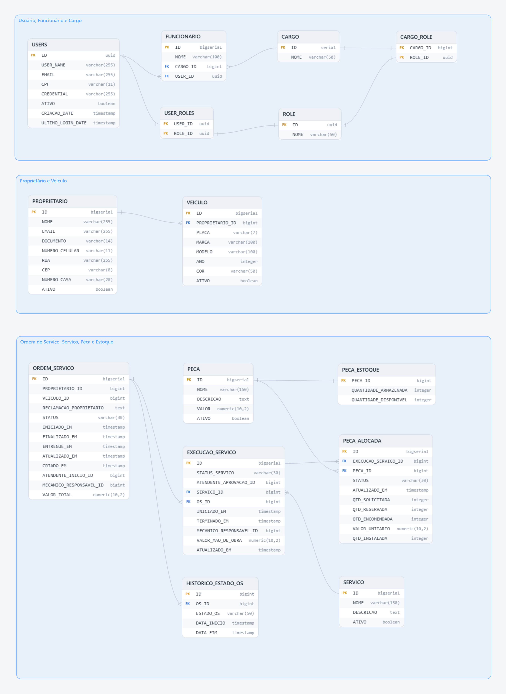

# Diagrama Entidade Relacionamento
Conforme mencionado nas ADRs, optamos por utilizar um banco de dados relacional e o banco selecionado foi o PostgreSQL, por ser de fácil uso, atender às necessidades do projeto e ser de maior familiaridade com o time.

A escolha pelo modelo relacional também se deve à característica dos dados do sistema, que possuem relacionamentos bem definidos entre proprietário, veículo, ordem de serviço, serviços executados, peças e funcionários. O uso de chaves primárias, estrangeiras, restrições de unicidade e tabelas associativas permite manter a integridade e consistência dessas informações durante todo o fluxo da oficina.

## Diagrama de Entidade Relacionamento

## Principais Tabelas e Relacionamentos

### Tabelas USERS, ROLE, FUNCIONARIO, CARGO

`USERS` é a tabela base para os usuários que possuem acesso ao sistema. A partir dela é possível criar usuários para funcionários de diferentes cargos e, futuramente, também para proprietários.

Cada usuário possui e-mail e CPF como dados únicos de identificação. O CPF foi adicionado posteriormente ao modelo como segundo fator de identificação do usuário e também é utilizado pelo fluxo de autenticação serverless para emissão do JWT, mantendo o login por e-mail e senha disponível.

Cada usuário pode possuir uma lista de roles através da tabela `USER_ROLES`, responsável por controlar as permissões que ele pode executar no sistema. Para os funcionários, cada `FUNCIONARIO` possui um `CARGO`, e cada cargo possui uma lista de roles através da tabela `CARGO_ROLE`, definindo as permissões esperadas para cada função da oficina.

Dessa forma, os relacionamentos `USERS` x `ROLE` e `CARGO` x `ROLE` são do tipo muitos-para-muitos, resolvidos pelas tabelas associativas.

### Tabelas PROPRIETARIO, VEICULO

No sistema optamos por chamar o cliente de Proprietário. A tabela `PROPRIETARIO` armazena suas informações básicas e se relaciona com os veículos cadastrados.

Um proprietário pode possuir vários veículos, enquanto cada `VEICULO` pertence a um proprietário. Esse relacionamento é utilizado posteriormente na criação da Ordem de Serviço, permitindo identificar tanto o responsável quanto o veículo que será atendido.

### Tabelas SERVICO, PECA, PECA_ESTOQUE

As tabelas `SERVICO`, como troca de óleo ou alinhamento, e `PECA`, como filtro ou pastilha de freio, representam os cadastros básicos utilizados durante o diagnóstico e execução da Ordem de Serviço.

A tabela `PECA_ESTOQUE` possui os dados necessários para o controle de estoque da oficina. Cada peça possui um registro de estoque, contendo a quantidade armazenada e a quantidade atualmente disponível para novas Ordens de Serviço. A separação entre PECA e PECA_ESTOQUE permite manter os dados de catálogo separados das gestão de estoque.

### Tabelas ORDEM_SERVICO, EXECUCAO_SERVICO, PECA_ALOCADA

`ORDEM_SERVICO` registra o atendimento realizado para o veículo de um proprietário. Ela é criada pelo atendente e concentra as informações gerais do atendimento, como reclamação do proprietário, veículo, responsáveis, status e valor total.

Durante o diagnóstico, o mecânico identifica os serviços que devem ser realizados. Cada serviço identificado gera uma `EXECUCAO_SERVICO`, permitindo que uma mesma Ordem de Serviço tenha vários serviços com status, valor de mão de obra e responsável próprios.

Para cada execução podem ser relacionadas várias `PECA_ALOCADA`. Essa tabela registra as peças necessárias para o serviço e controla quantidade solicitada, reservada, encomendada e instalada. A mesma peça não pode ser adicionada mais de uma vez para uma mesma execução, sendo essa regra garantida por uma restrição de unicidade.

Ao finalizar o diagnóstico, o proprietário deve aprovar os serviços que serão executados. Após a aprovação e disponibilidade das peças, o mecânico inicia as execuções e, quando todas forem finalizadas, a Ordem de Serviço pode ser concluída e o veículo liberado para retirada.

### Tabela HISTORICO_ESTADO_OS

A tabela HISTORICO_ESTADO_OS mantém o histórico das mudanças de estado de cada Ordem de Serviço. Uma Ordem de Serviço pode possuir vários registros de histórico, armazenando o estado, data de início e data de fim de cada período. Dessa forma é possível calcular o tempo gasto em cada etapa e posteriormente obter indicadores como o tempo médio de execução das Ordens de Serviço.