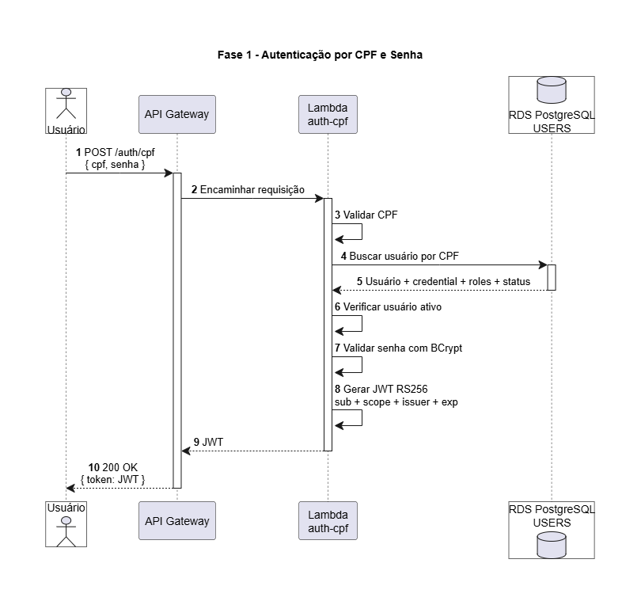
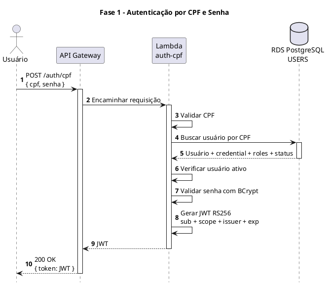
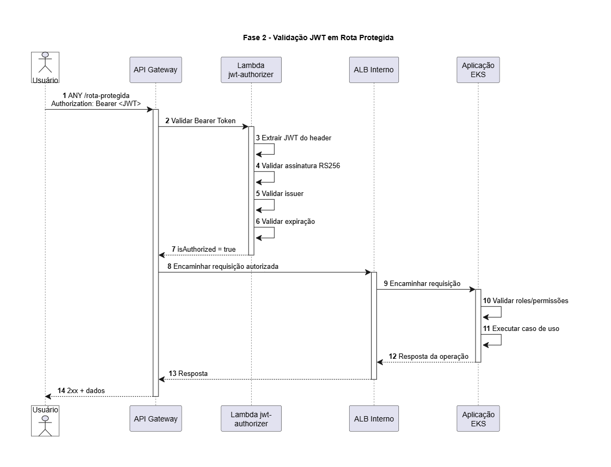
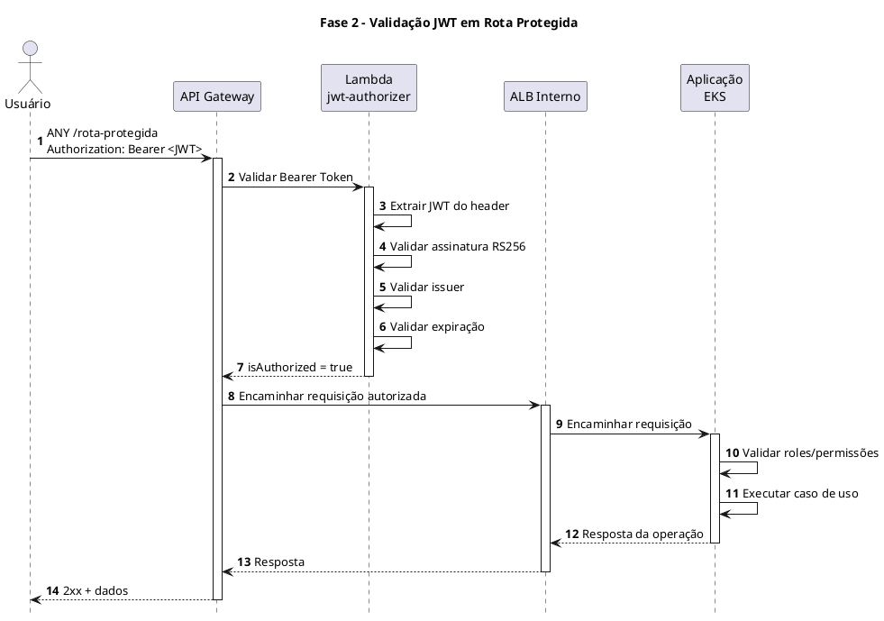
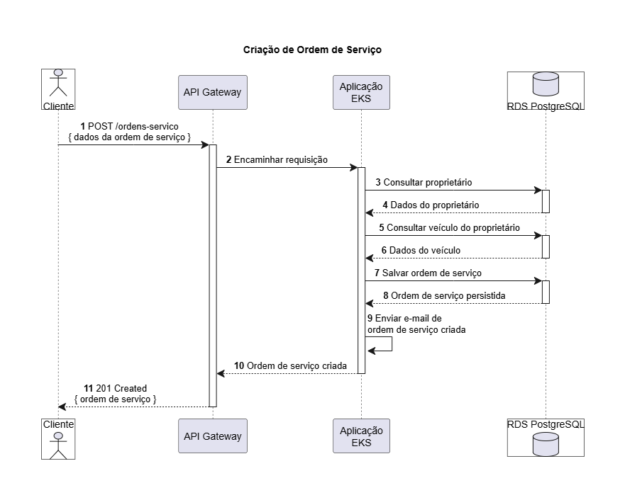
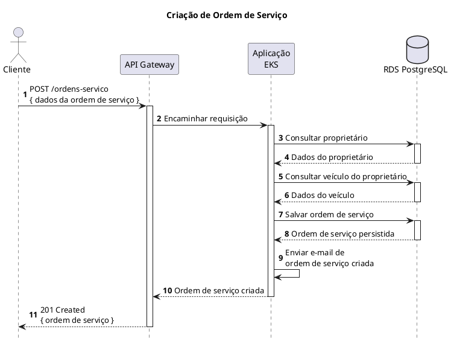

# Diagramas de Sequência
## Autenticação JWT

Este documento descreve, de forma resumida, os dois fluxos de autenticação utilizados pelo sistema: **emissão do token JWT** e **validação do token em rotas protegidas**.

A solução utiliza um único **API Gateway** na AWS e duas funções **AWS Lambda** com responsabilidades distintas:

* `auth-cpf`: responsável pelo login com CPF e senha e pela geração do JWT.
* `jwt-authorizer`: responsável por validar o JWT antes de permitir que uma requisição protegida chegue à aplicação.

---

### Fluxo 1 — Autenticação por CPF e Senha

O primeiro fluxo é responsável por autenticar o usuário e gerar um token JWT.

A requisição é enviada para:

```text
POST /auth/cpf
```

com CPF e senha no corpo da requisição.

O fluxo ocorre da seguinte forma:

1. O cliente envia CPF e senha para o API Gateway.
2. O API Gateway encaminha a requisição para a Lambda `auth-cpf`.
3. A Lambda valida o CPF informado.
4. O usuário é consultado no RDS PostgreSQL.
5. A Lambda verifica se o usuário está ativo.
6. A senha informada é comparada com o hash armazenado utilizando BCrypt.
7. Após a autenticação, é gerado um JWT assinado com RS256.
8. O token é retornado ao cliente.

O JWT contém as informações necessárias para identificação e autenticação do usuário, como:

* `sub`
* `scope`
* `issuer`
* `exp`

#### Diagrama de sequência



Codigo PlantUML do diagrama:


---

### Fluxo 2 — Validação do JWT em Rota Protegida

O segundo fluxo ocorre quando o cliente tenta acessar uma rota protegida da aplicação.

O token recebido no login deve ser enviado no header HTTP:

```text
Authorization: Bearer <JWT>
```

O fluxo funciona da seguinte forma:

1. O cliente envia uma requisição para uma rota protegida.
2. O API Gateway chama a Lambda `jwt-authorizer`.
3. O authorizer extrai o JWT do header `Authorization`.
4. A assinatura RS256 é validada.
5. O `issuer` é validado.
6. A expiração do token é verificada.
7. Caso o token seja válido, o authorizer retorna `isAuthorized = true`.
8. O API Gateway encaminha a requisição para o ALB interno.
9. O ALB encaminha a chamada para a aplicação executada no EKS.
10. A aplicação realiza a validação de roles/permissões e executa o caso de uso solicitado.

A responsabilidade do `jwt-authorizer` é validar a **autenticação** do usuário. A autorização baseada em roles e permissões continua sendo responsabilidade da aplicação.

#### Diagrama de sequência



Codigo PlantUML do diagrama:


---
## Criação de Ordem de Serviço

A Ordem de Serviço representa o atendimento realizado pela oficina e relaciona o **Proprietário** ao seu **Veículo**, permitindo posteriormente o acompanhamento das etapas de diagnóstico, aprovação e execução do serviço.

O fluxo de criação também realiza o envio de uma notificação ao Proprietário após o registro da OS. Esse comportamento está alinhado ao fluxo de negócio definido para o sistema, no qual o atendente cadastra proprietário e veículo, cria a Ordem de Serviço e o sistema notifica o proprietário sobre o recebimento da OS.

---

### Fluxo — Criação de Ordem de Serviço

A criação de uma Ordem de Serviço é realizada através do endpoint:

```text
POST /ordens-servico
```

A requisição contém os dados necessários para identificar o Proprietário, o Veículo e criar a nova Ordem de Serviço.

O fluxo ocorre da seguinte forma:

1. O cliente envia uma requisição `POST /ordens-servico` para o sistema.
2. O API Gateway recebe e encaminha a requisição para a aplicação executada no EKS.
3. A aplicação consulta o Proprietário na base de dados.
4. Após localizar o Proprietário, a aplicação consulta o Veículo associado a ele.
5. A aplicação cria e persiste a nova Ordem de Serviço no RDS PostgreSQL.
6. Após a criação da OS, a própria aplicação envia uma notificação por e-mail ao Proprietário.
7. A aplicação retorna a Ordem de Serviço criada.
8. O cliente recebe a resposta HTTP `201 Created` contendo os dados da nova OS.

A consulta prévia de Proprietário e Veículo garante que a Ordem de Serviço seja criada utilizando as referências existentes no domínio antes de sua persistência.

---

### Diagrama de Sequência



Codigo PlantUML do diagrama:
