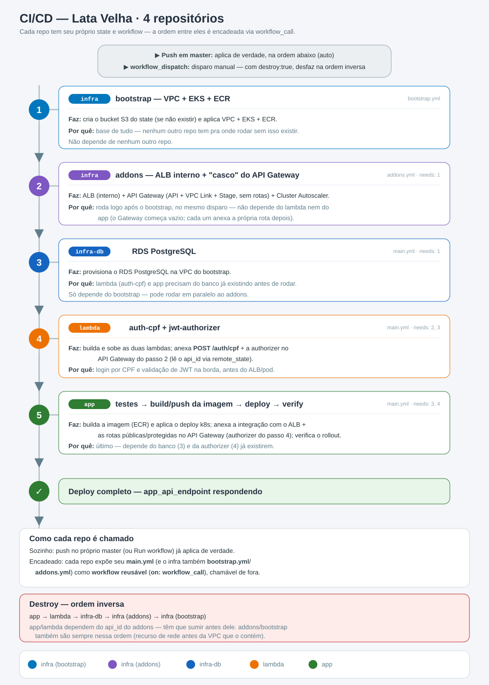
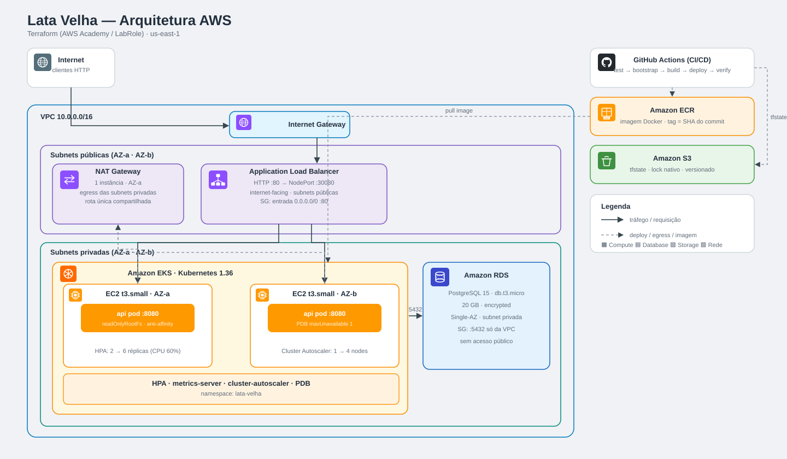

# Infraestrutura — Lata Velha (AWS + EKS)

Infraestrutura como código para o projeto **Lata Velha** na AWS usando **Terraform >= 1.10** (lock de estado nativo do S3).

Compatível com **AWS Academy (Learner Lab)** — usa a `LabRole` pré-existente sem precisar criar IAM roles ou OIDC providers.

---

## Visão geral

O GitHub Actions provisiona a infra e implanta a aplicação em **5 jobs encadeados** — cada um só roda se o anterior passar; o CD executa apenas em push para `master`.



**Atalhos:** [Arquitetura](#arquitetura) · [O que é provisionado](#o-que-é-provisionado) · [Segurança](#segurança--disponibilidade) · [Rodar localmente](#rodando-localmente--passo-a-passo) · [Rodar com Terraform](#comandos-terraform-diretos-sem-applysh) · [GitHub Actions](#github-actions--configuração-de-secrets-e-variáveis) · [Custo](#custo-aproximado-us-east-1)

---

## Arquitetura



<details>
<summary>Versão em texto (ASCII)</summary>

```
Internet
   │
   ▼
AWS ALB (Application Load Balancer)          ← Terraform: modules/alb
   │  HTTP 80 → NodePort 30080
   ▼
EKS Node Group (EC2 t3.small × 2)           ← nodes em subnet privada
   │
   ▼
Pods lata-velha-api (2 réplicas, HPA até 10)
   │
   ▼
RDS PostgreSQL 15 (db.t3.micro)             ← subnet privada, sem acesso público
```

</details>

### Por que ALB gerenciado pelo Terraform e não pelo AWS Load Balancer Controller?

O **ALB Controller** cria recursos AWS (ALBs, Security Groups, ENIs) fora do estado
do Terraform. No `destroy`, esses recursos bloqueiam a deleção da VPC e exigem scripts
de limpeza externos — uma solução frágil.

Com o ALB provisionado diretamente pelo Terraform via `aws_lb`, `aws_lb_target_group`
e `aws_autoscaling_attachment`, o `terraform destroy` remove tudo na ordem certa,
sem scripts auxiliares.

O tráfego chega ao ALB na porta 80 e é encaminhado para o **NodePort 30080** de
qualquer node do EKS. A associação ao ASG (`aws_autoscaling_attachment`) registra
e desregistra nodes automaticamente conforme o cluster escala.

---

## O que é provisionado

### Módulo `bootstrap` — infraestrutura base

| Recurso        | Descrição                                                             |
| -------------- | --------------------------------------------------------------------- |
| VPC            | CIDR `10.0.0.0/16`, 2 AZs, subnets públicas + privadas + NAT Gateway |
| ECR            | Repositório Docker privado (`lata-velha`)                             |
| EKS Cluster    | Control plane gerenciado, Kubernetes 1.36                             |
| EKS Node Group | EC2 `t3.small`, autoscaling: desejado 2 / min 1 / max 4              |
| RDS PostgreSQL | `db.t3.micro`, 20 GB, **criptografado**, subnet privada, sem multi-AZ |

### Módulo `deploy` — aplicação e roteamento

| Recurso AWS              | Descrição                                                         |
| ------------------------ | ----------------------------------------------------------------- |
| ALB                      | Application Load Balancer internet-facing, HTTP 80                |
| Target Group             | `target_type=instance`, NodePort 30080, health check `/actuator/health/readiness` |
| Listener                 | HTTP 80 → forward para o Target Group                             |
| Security Group (ALB)     | Permite entrada HTTP 80 da internet                               |
| Security Group Rule      | Permite tráfego ALB → nodes EKS na porta 30080                    |
| ASG Attachment           | Registra automaticamente os nodes EKS no Target Group             |

| Recurso Kubernetes       | Descrição                                                         |
| ------------------------ | ----------------------------------------------------------------- |
| Namespace                | `lata-velha`                                                      |
| Secret `aws-credentials` | Credenciais AWS para o Cluster Autoscaler (kube-system)           |
| ConfigMap                | Variáveis não-sensíveis da aplicação                              |
| Secret                   | Credenciais do banco e e-mail (base64 via Terraform)              |
| Deployment               | 2 réplicas, probes liveness/readiness/startup, `readOnlyRootFilesystem`, anti-affinity |
| Service                  | NodePort 30080 → 8080                                             |
| HPA                      | Autoscaling por CPU (60%) entre 2 e 6 réplicas                    |
| PDB                      | PodDisruptionBudget — no máx. 1 pod indisponível em manutenção    |
| Cluster Autoscaler       | Adiciona/remove nodes EC2 conforme demanda                        |
| Metrics Server           | Coleta CPU/memória dos pods — obrigatório para o HPA              |

---

## Segurança & disponibilidade

Boas práticas aplicadas além do provisionamento básico:

- **Estado do Terraform com lock nativo do S3** (`use_lockfile`) — impede dois `apply` simultâneos de corromperem o state, sem precisar de DynamoDB.
- **RDS criptografado em repouso** (`storage_encrypted`, chave gerenciada `aws/rds`).
- **Banco isolado** — Security Group libera a porta 5432 apenas de dentro da VPC; sem acesso público.
- **Container endurecido** — `runAsNonRoot`, `readOnlyRootFilesystem` (com `/tmp` em `emptyDir`) e `allowPrivilegeEscalation: false`.
- **Alta disponibilidade** — réplicas espalhadas entre nodes (`podAntiAffinity`) e um **PodDisruptionBudget** que mantém ao menos 1 pod servindo durante manutenções.
- **Autoscaling em duas camadas** — HPA por CPU (2→6 pods) e Cluster Autoscaler (1→4 nodes).

---

## Estrutura de arquivos

```
infra/
├── k8s/                          # Manifests Kubernetes (aplicados pelo módulo deploy)
│   ├── namespace.yaml
│   ├── configmap.yaml
│   ├── secret.yaml               # template — valores base64 injetados pelo Terraform
│   ├── deployment.yaml           # template — docker_image injetado pelo Terraform
│   ├── service.yaml              # NodePort 30080
│   ├── hpa.yaml                  # Autoscaling por CPU (2–6 réplicas)
│   └── pdb.yaml                  # PodDisruptionBudget
└── terraform/
    ├── apply.sh                  # Orquestrador de deploy (local e CI/CD)
    ├── bootstrap/                # Etapa 1: VPC + EKS + RDS + ECR
    │   ├── main.tf
    │   ├── variables.tf
    │   ├── outputs.tf            # Expõe endpoints e IDs para o módulo deploy
    │   ├── providers.tf          # Somente provider AWS
    │   ├── versions.tf
    │   ├── backend.tf            # Estado em S3: lata-velha/bootstrap/terraform.tfstate
    │   └── terraform.tfvars.example
    ├── deploy/                   # Etapa 2: ALB + app + autoscaler
    │   ├── main.tf               # Lê infra via terraform_remote_state
    │   ├── variables.tf          # Conexão EKS via variáveis (para provider config)
    │   ├── outputs.tf            # app_url
    │   ├── providers.tf          # Providers AWS + kubectl + helm
    │   ├── versions.tf
    │   ├── backend.tf            # Estado em S3: lata-velha/deploy/terraform.tfstate
    │   └── terraform.tfvars.example
    └── modules/                  # Módulos reutilizáveis
        ├── vpc/
        ├── eks/
        ├── rds/
        ├── alb/
        ├── cluster-autoscaler/
        └── app/                  # kubectl_manifest para todos os objetos k8s
```

### Por que dois módulos Terraform separados (`bootstrap` e `deploy`)?

Os providers `kubectl` e `helm` precisam do endpoint do cluster EKS para serem
inicializados — e esse endpoint só existe após o EKS ser criado.

Em um único módulo isso cria um problema: o Terraform tenta configurar os providers
antes de provisionar o cluster, e falha. A solução padrão é dividir em dois módulos
com estados independentes:

- **`bootstrap`** provisiona o EKS (e VPC/RDS/ECR) usando apenas o provider AWS.
- **`deploy`** lê o endpoint do EKS via `terraform_remote_state` e usa esse valor
  para configurar os providers `kubectl` e `helm` — que já encontram o cluster ativo.

O `apply.sh` lê os outputs do `bootstrap` e os passa para o `deploy` via variáveis
de ambiente (`TF_VAR_`), já que blocos `provider` não aceitam `data sources`.

---

## Compatibilidade com AWS Academy

O AWS Academy (Learner Lab) tem restrições de IAM. A tabela abaixo mostra como cada uma é resolvida:

| Restrição                                 | Como é resolvida                                                            |
| ----------------------------------------- | --------------------------------------------------------------------------- |
| `iam:CreateRole` negado                   | Usa a `LabRole` pré-existente para cluster, nodes e ALB                     |
| `iam:CreateOpenIDConnectProvider` negado  | IRSA removido — credenciais injetadas via `kubectl_manifest` (Secret k8s)   |
| IMDS hop limit = 1 nos nodes              | Pods não alcançam instance profile — resolvido pelo secret acima            |
| ARN de assumed-role no Access Entry       | Convertido automaticamente para ARN de IAM role via `sts:GetCallerIdentity` |
| Recursos externos bloqueando VPC no destroy | ALB gerenciado pelo Terraform — destruído em ordem correta sem scripts    |

### O que não foi possível por causa do Academy

Algumas boas práticas foram **deliberadamente deixadas de fora** porque o Learner Lab as bloqueia:

| Não implementado                          | Por quê (restrição do Academy)                                              | O que foi feito no lugar                          |
| ----------------------------------------- | --------------------------------------------------------------------------- | ------------------------------------------------- |
| **OIDC para credenciais no CI/CD**        | `iam:CreateOpenIDConnectProvider` negado                                    | Secrets estáticos `AWS_*` + `SESSION_TOKEN` (expiram em ~4h, renovados a cada sessão) |
| **HTTPS/TLS no ALB**                      | ACM exige domínio validado e o Route 53 (`CreateHostedZone`) é bloqueado    | ALB serve apenas **HTTP :80**                     |
| **Endpoint do EKS restrito (privado/CIDR)** | O IP do runner do GitHub é dinâmico e as credenciais trocam por sessão     | Endpoint **público** (com acesso via Access Entry) |
| **Chave KMS própria (CMK) no RDS**        | Criação de CMK bloqueada                                                     | Criptografia com a chave gerenciada `aws/rds`     |
| **IRSA (IAM Roles for Service Accounts)** | Depende de OIDC provider, negado                                            | Credenciais injetadas via Secret do Kubernetes    |
| **`deletion_protection` no RDS / backups** | —                                                                          | Mantido desligado de propósito: o lab é descartável |

> Em um ambiente AWS real (fora do Academy), o recomendado seria: OIDC no pipeline, ALB com HTTPS via ACM, endpoint do EKS privado e CMK dedicada — todos viáveis quando há permissões completas de IAM/Route 53/KMS.

---

## Pré-requisitos locais

| Ferramenta   | Versão mínima | Para que serve                                    |
| ------------ | ------------- | ------------------------------------------------- |
| Terraform    | >= 1.10       | provisionar a infra (lock de estado nativo do S3) |
| AWS CLI      | v2            | autenticar providers e rodar `aws eks get-token`  |
| Docker       | qualquer      | build e push da imagem para o ECR                 |
| kubectl      | qualquer      | inspecionar o cluster (opcional, mas recomendado) |
| Java + Maven | Java 21       | rodar os testes (necessário para `--pipeline`)    |

---

## Rodando localmente — passo a passo

### 1. Configurar o AWS CLI

Antes de qualquer coisa, o AWS CLI precisa estar autenticado. No **AWS Academy**, abra
o Learner Lab, clique em **AWS Details** e escolha uma das opções abaixo:

**Opção A — variáveis de ambiente (recomendado para sessões únicas):**

```bash
export AWS_ACCESS_KEY_ID=ASIA...
export AWS_SECRET_ACCESS_KEY=...
export AWS_SESSION_TOKEN=...
export AWS_DEFAULT_REGION=us-east-1
```

**Opção B — `aws configure` (persiste entre terminais):**

```bash
aws configure
# AWS Access Key ID:     ASIA...
# AWS Secret Access Key: ...
# Default region name:   us-east-1
# Default output format: json

# O Session Token precisa ser adicionado separadamente:
aws configure set aws_session_token ...
```

> As credenciais do Academy expiram em ~4 horas. Repita este passo sempre que a sessão expirar.

Verifique se está autenticado:

```bash
aws sts get-caller-identity
```

Deve retornar seu `Account`, `UserId` e `Arn` sem erros.

### 2. Configurar as variáveis do Terraform

```bash
cd infra/terraform
cp bootstrap/terraform.tfvars.example bootstrap/terraform.tfvars
cp deploy/terraform.tfvars.example    deploy/terraform.tfvars
```

Edite `bootstrap/terraform.tfvars`:

```hcl
db_password = "sua_senha_do_banco"   # mínimo 8 caracteres
```

Edite `deploy/terraform.tfvars`:

```hcl
mail_username = "seu@gmail.com"
mail_password = "xxxx xxxx xxxx xxxx"   # Senha de App do Gmail
```

> `db_password` e `db_username` são definidos **apenas no bootstrap** — o módulo `deploy` lê esses valores automaticamente via `terraform_remote_state`, sem duplicação.

> **Nunca commite os arquivos `terraform.tfvars`** — já estão no `.gitignore`.

### 3. Rodar o pipeline completo

```bash
./apply.sh --auto
```

O pipeline executa automaticamente em 5 etapas:

```
[1/5] Testes     →  PostgreSQL Docker efêmero + mvn test
[2/5] Bootstrap  →  terraform apply  (VPC + EKS + RDS + ECR)   ~15 min
[3/5] Docker     →  docker build --platform linux/amd64 + push para ECR
[4/5] Deploy     →  terraform apply  (ALB + app + autoscaler)
[5/5] Verificar  →  kubectl rollout status  (timeout 5 min)
```

Tempo total: **~20–30 minutos** na primeira execução.

**Quer pular os testes Maven?**

```bash
./apply.sh --auto --skip-test
```

### 4. Verificar o deploy

```bash
# Aponta o kubectl para o cluster
aws eks update-kubeconfig --region us-east-1 --name lata-velha-eks

# Verifica se os pods subiram
kubectl get pods -n lata-velha

# Pega a URL do ALB (aguarde ~2 min para ficar ativo)
terraform -chdir=deploy output app_url

# Testa a API
curl http://<DNS_DO_ALB>/actuator/health
```

### 5. Destruir o ambiente

```bash
./apply.sh --destroy --auto
```

O destroy acontece em ordem reversa:

1. **Deploy** — remove ALB, Target Group, app Kubernetes e autoscaler
2. **Bootstrap** — remove EKS, VPC, RDS, ECR
3. **Bucket S3** — remove o estado remoto do Terraform

> **Destrua o ambiente quando não precisar** — o EKS control plane custa ~US$ 73/mês mesmo sem tráfego.

---

## Flags do apply.sh

```bash
./apply.sh                    # pipeline completo com confirmação interativa
./apply.sh --auto             # pipeline completo sem confirmação
./apply.sh --skip-test        # pula os testes Maven
./apply.sh --auto --skip-test # sem confirmação e sem testes
./apply.sh --destroy          # destroi tudo com confirmação
./apply.sh --destroy --auto   # destroi tudo sem confirmação
```

---

## GitHub Actions — configuração de secrets e variáveis

O pipeline CI/CD (`.github/workflows/main.yml`) roda automaticamente em todo push para `master`. Para funcionar, configure os seguintes valores no repositório GitHub:

`Settings → Secrets and variables → Actions`

### Secrets

| Nome                    | Valor                 | Onde obter                                                          |
| ----------------------- | --------------------- | ------------------------------------------------------------------- |
| `AWS_ACCESS_KEY_ID`     | `ASIA...`             | AWS Academy → AWS Details                                           |
| `AWS_SECRET_ACCESS_KEY` | `...`                 | AWS Academy → AWS Details                                           |
| `AWS_SESSION_TOKEN`     | `...`                 | AWS Academy → AWS Details                                           |
| `TF_DB_PASSWORD`        | senha do banco        | você define (mínimo 8 chars)                                        |
| `TF_DB_USERNAME`        | `lata_velha_user`     | padrão ou personalize                                               |
| `TF_MAIL_USERNAME`      | `seu@gmail.com`       | sua conta Gmail                                                     |
| `TF_MAIL_PASSWORD`      | `xxxx xxxx xxxx xxxx` | [Senha de App do Google](https://myaccount.google.com/apppasswords) |

### Variables

| Nome               | Valor            |
| ------------------ | ---------------- |
| `AWS_REGION`       | `us-east-1`      |
| `EKS_CLUSTER_NAME` | `lata-velha-eks` |

> **Importante:** As credenciais AWS expiram com cada sessão do Academy. Atualize-as antes de cada push para `master`.

### Pipeline do GitHub Actions

(diagrama na [Visão geral](#visão-geral))

| Job            | Fase | O que faz                                                  |
| -------------- | ---- | ---------------------------------------------------------- |
| `test`         | CI   | compila e roda toda a suíte de testes (mvn)                |
| `tf-bootstrap` | CD   | provisiona VPC + EKS + RDS + ECR (Terraform)               |
| `build`        | CD   | builda a imagem e envia ao ECR com tag = SHA do commit     |
| `tf-deploy`    | CD   | aplica ALB + app + cluster-autoscaler no cluster           |
| `verify`       | CD   | aguarda o rollout e faz smoke test em `/actuator/health`   |

Cada job só roda se o anterior passar (`needs`). As etapas CD só rodam em **push direto para `master`** — em Pull Requests roda apenas o `test`.

---

## Comandos Terraform diretos (sem apply.sh)

<details>
<summary>Equivalente ao <code>apply.sh</code>, executando cada passo manualmente — referência e depuração (clique para expandir).</summary>


> **Pré-requisito:** configure os arquivos `.tfvars` conforme o passo 2 da seção anterior antes de rodar os comandos abaixo.

### 1. Criar o bucket de estado S3

```bash
ACCOUNT_ID=$(aws sts get-caller-identity --query Account --output text)
BUCKET="lata-velha-tfstate-${ACCOUNT_ID}"
REGION="us-east-1"

aws s3 mb "s3://$BUCKET" --region $REGION
aws s3api put-bucket-versioning \
  --bucket $BUCKET \
  --versioning-configuration Status=Enabled
```

### 2. Bootstrap — VPC + EKS + RDS + ECR

O `db_password` é lido automaticamente do `bootstrap/terraform.tfvars`.

```bash
cd infra/terraform

terraform -chdir=bootstrap init \
  -backend-config="bucket=$BUCKET" \
  -backend-config="region=$REGION"

terraform -chdir=bootstrap plan
terraform -chdir=bootstrap apply
```

### 3. Capturar outputs do bootstrap

O módulo `deploy` precisa do endpoint do cluster EKS para configurar os providers `kubectl` e `helm`. Exporte como `TF_VAR_` para que o Terraform os leia automaticamente:

```bash
export TF_VAR_state_bucket="$BUCKET"
export TF_VAR_cluster_name=$(terraform -chdir=bootstrap output -raw cluster_name)
export TF_VAR_cluster_endpoint=$(terraform -chdir=bootstrap output -raw cluster_endpoint)
export TF_VAR_cluster_ca_data=$(terraform -chdir=bootstrap output -raw cluster_certificate_authority_data)

# Credenciais para o Cluster Autoscaler (AWS Academy não suporta IRSA)
export TF_VAR_aws_access_key_id="$AWS_ACCESS_KEY_ID"
export TF_VAR_aws_secret_access_key="$AWS_SECRET_ACCESS_KEY"
export TF_VAR_aws_session_token="$AWS_SESSION_TOKEN"
```

### 4. Build e push da imagem Docker

```bash
ECR_URL=$(terraform -chdir=bootstrap output -raw ecr_repository_url)
IMAGE="${ECR_URL}:$(git rev-parse --short HEAD)"

aws ecr get-login-password --region $REGION \
  | docker login --username AWS --password-stdin "$ECR_URL"

docker build --platform linux/amd64 -t "$IMAGE" ../../
docker push "$IMAGE"
```

### 5. Deploy — ALB + app + autoscaler

`mail_username` e `mail_password` são lidos do `deploy/terraform.tfvars`. Somente `docker_image` é passado via variável de ambiente por ser calculado em tempo de execução.

```bash
export TF_VAR_docker_image="$IMAGE"

terraform -chdir=deploy init \
  -backend-config="bucket=$BUCKET" \
  -backend-config="region=$REGION"

terraform -chdir=deploy plan
terraform -chdir=deploy apply
```

### 6. Verificar o deploy

```bash
CLUSTER=$(terraform -chdir=bootstrap output -raw cluster_name)
aws eks update-kubeconfig --region $REGION --name $CLUSTER

kubectl get pods -n lata-velha
kubectl rollout status deployment/lata-velha-api -n lata-velha --timeout=5m

terraform -chdir=deploy output app_url
```

### 7. Destroy — ordem reversa

```bash
# 1. Destroi o módulo deploy (ALB + app + autoscaler)
terraform -chdir=deploy init \
  -backend-config="bucket=$BUCKET" \
  -backend-config="region=$REGION"
terraform -chdir=deploy destroy

# 2. Destroi o módulo bootstrap (VPC + EKS + RDS + ECR)
terraform -chdir=bootstrap init \
  -backend-config="bucket=$BUCKET" \
  -backend-config="region=$REGION"
terraform -chdir=bootstrap destroy

# 3. Remove o bucket de estado (deleta versões e delete markers antes)
REGION="${AWS_DEFAULT_REGION:-us-east-1}"

aws s3api list-object-versions --bucket "$BUCKET" --output text \
  --query 'Versions[?VersionId!=`null`].[Key,VersionId]' 2>/dev/null | \
  while read -r key version; do
    aws s3api delete-object --bucket "$BUCKET" --key "$key" --version-id "$version" > /dev/null
  done

aws s3api list-object-versions --bucket "$BUCKET" --output text \
  --query 'DeleteMarkers[?VersionId!=`null`].[Key,VersionId]' 2>/dev/null | \
  while read -r key version; do
    aws s3api delete-object --bucket "$BUCKET" --key "$key" --version-id "$version" > /dev/null
  done

# Remove objetos sem VersionId (enviados antes do versionamento ser ativado)
aws s3 rm "s3://$BUCKET" --recursive > /dev/null 2>&1 || true
aws s3api delete-bucket --bucket "$BUCKET" --region "$REGION"
```

</details>

---

## Variáveis do Terraform

<details>
<summary>Tabelas completas de variáveis dos módulos <code>bootstrap</code> e <code>deploy</code> (clique para expandir).</summary>

### Módulo `bootstrap`

| Variável             | Padrão            | Descrição                           |
| -------------------- | ----------------- | ----------------------------------- |
| `region`             | `us-east-1`       | Região AWS                          |
| `project_name`       | `lata-velha`      | Prefixo de todos os recursos        |
| `environment`        | `dev`             | Tag de ambiente                     |
| `vpc_cidr`           | `10.0.0.0/16`     | CIDR da VPC                         |
| `kubernetes_version` | `1.36`            | Versão do Kubernetes                |
| `node_instance_type` | `t3.small`        | Tipo de EC2 dos nodes               |
| `node_desired_size`  | `2`               | Quantidade inicial de nodes         |
| `node_min_size`      | `1`               | Mínimo de nodes                     |
| `node_max_size`      | `4`               | Máximo de nodes                     |
| `db_name`            | `lata_velha`      | Nome do banco                       |
| `db_username`        | `lata_velha_user` | Usuário do banco                    |
| `db_password`        | —                 | Senha do banco (**obrigatória**)    |
| `rds_instance_class` | `db.t3.micro`     | Classe da instância RDS             |

### Módulo `deploy`

| Variável                | Padrão        | Descrição                                                        |
| ----------------------- | ------------- | ---------------------------------------------------------------- |
| `region`                | `us-east-1`   | Região AWS                                                       |
| `project_name`          | `lata-velha`  | Prefixo dos recursos                                             |
| `docker_image`          | `placeholder` | Imagem ECR (definida automaticamente pelo pipeline)              |
| `db_username`           | `lata_velha_user` | Usuário do banco                                             |
| `db_password`           | —             | Senha do banco (**obrigatória**)                                 |
| `mail_username`         | —             | Email remetente Gmail (**obrigatório**)                          |
| `mail_password`         | —             | App password do Gmail (**obrigatório**)                          |
| `state_bucket`          | —             | Injetado pelo apply.sh — não colocar no tfvars                   |
| `cluster_endpoint`      | —             | Injetado pelo apply.sh — não colocar no tfvars                   |
| `cluster_ca_data`       | —             | Injetado pelo apply.sh — não colocar no tfvars                   |
| `cluster_name`          | —             | Injetado pelo apply.sh — não colocar no tfvars                   |
| `aws_access_key_id`     | —             | Injetado pelo apply.sh — não colocar no tfvars                   |
| `aws_secret_access_key` | —             | Injetado pelo apply.sh — não colocar no tfvars                   |
| `aws_session_token`     | —             | Injetado pelo apply.sh — não colocar no tfvars                   |

</details>

---

## Custo aproximado (us-east-1)

| Recurso                  | Configuração  | Custo/mês        |
| ------------------------ | ------------- | ---------------- |
| EKS control plane        | fixo          | ~US$ 73          |
| EC2 nodes (t3.small × 2) | On-Demand     | ~US$ 30          |
| NAT Gateway              | 1 AZ          | ~US$ 32          |
| ALB                      | 1 ALB         | ~US$ 18          |
| RDS db.t3.micro          | PostgreSQL 15 | ~US$ 15          |
| **Total estimado**       |               | **~US$ 168/mês** |

> No **AWS Academy** o crédito é limitado (~US$ 50). Destrua o ambiente com `./apply.sh --destroy --auto` após cada uso.
